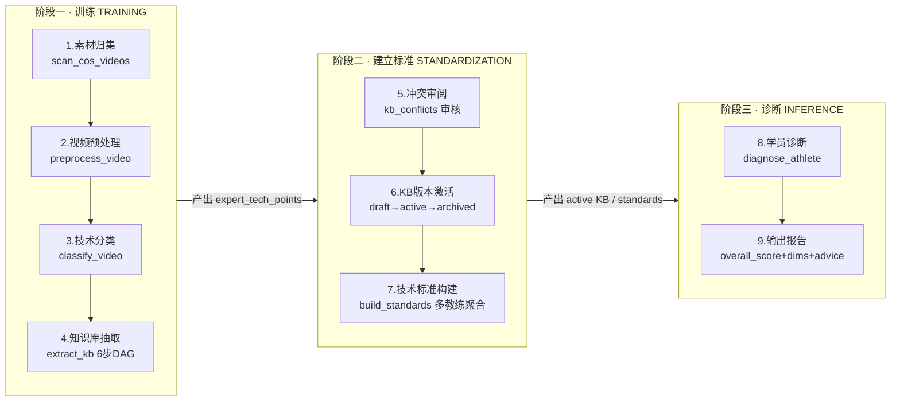
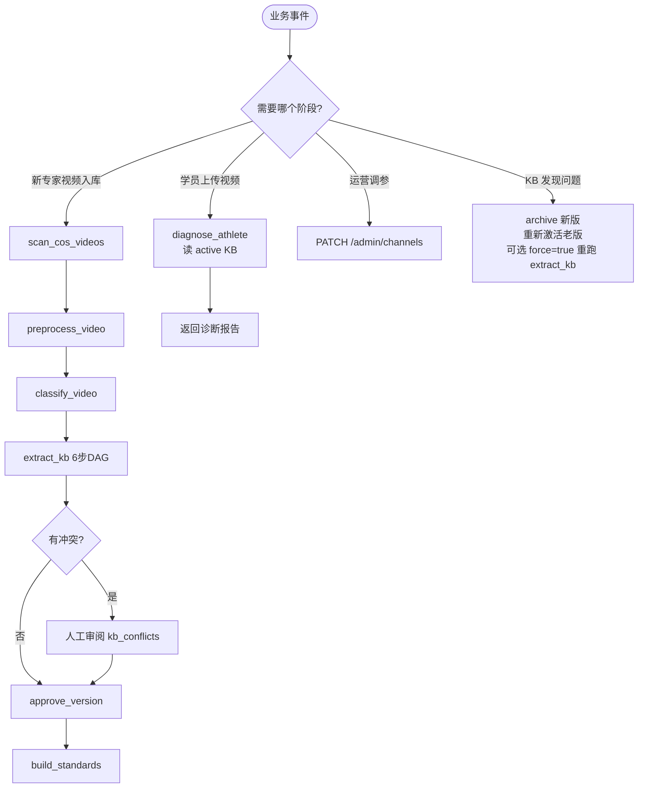

# 业务执行流程规范

> 本文档抽象项目的核心业务为**三阶段八步骤**执行模型，明确每一步的触发条件、执行者、产物、状态与可观测指标，并给出可持续优化的杠杆与调度图。
>
> 适用对象：运营 / 开发 / SRE；配合 [architecture.md](./architecture.md)（技术架构）与 [features.md](./features.md)（功能清单）阅读。

---

## 1. 业务本质

```
专业教练视频  →  结构化专业知识库  →  业余运动员视频诊断 + 改进建议
   (输入)           (中间资产)                (输出)
```

整条链路把"只有专业教练看得懂的经验"变成"一套可机读的量化标准"，再拿这套标准去自动批改业余学员的动作，形成**可追溯、可审核、可回滚**的闭环。

---

## 2. 三阶段全景



**阶段分界线（DoD — Definition of Done）**：

| 阶段 | 必过判据 | 查询方式 |
|-----|---------|---------|
| 训练 | `extraction_jobs.status=success` 且 `coach_video_classifications.kb_extracted=true` | `GET /api/v1/extraction-jobs/{id}` |
| 建标 | `tech_knowledge_bases.status=active` 且所有 `kb_conflicts.resolution != null` | `GET /api/v1/knowledge-base/versions` |
| 诊断 | `diagnosis_reports` 行存在且 `overall_score != null` | `GET /api/v1/tasks/{task_id}` |

**阶段特性**：

- 阶段一是**冷链路**（离线批处理，可重跑，允许失败）
- 阶段二是**门控**（人审 + 规则把关，单 active 原子切换）
- 阶段三是**热链路**（只读，低延迟，关键路径不碰 LLM 时 50ms 级返回）

---

## 3. 阶段一 · 训练 TRAINING（专家视频 → 知识库草稿）

### 3.1 步骤总览

| # | 步骤 | 触发方式 | Celery 队列 | 并发 | 前置条件 | 产物 | 状态表 |
|---|------|---------|------------|------|---------|------|-------|
| 1 | **scan_cos_videos** | `POST /api/v1/classifications/scan` | `default` | 1 | COS 根路径可读（`COS_VIDEO_ALL_COCAH`） | `coach_video_classifications` + `coaches` | `analysis_tasks(task_type=video_classification, submitted_via=batch_scan)` |
| 2 | **preprocess_video** | 批量提交 `POST /api/v1/tasks type=video_preprocessing` | `preprocessing` | 3 | `coach_video_classifications` 存在 | 标准化 mp4 + N×180s 分片（COS）+ 16k mono WAV | `video_preprocessing_jobs` + `video_preprocessing_segments` |
| 3 | **classify_video** | 规则或 LLM 兜底 | `classification` | 1 | 分片已上传 | `tech_category` 字段落定（21 类之一） | `analysis_tasks(task_type=video_classification)` |
| 4 | **extract_kb**（6 步 DAG） | `POST /api/v1/tasks type=kb_extraction` | `kb_extraction` | 2 | `tech_category` 非空、预处理完成 | `expert_tech_points` + `kb_conflicts` + `kb_extracted=true` | `extraction_jobs` + `pipeline_steps`(×6) |

### 3.2 KB 抽取 DAG 的 6 个子步骤

```
wave1:  download_video
wave2:  pose_analysis           ∥  audio_transcription
wave3:  visual_kb_extract       ∥  audio_kb_extract
wave4:  merge_kb
```

每个子步骤对应一行 `pipeline_steps`，字段级可观测：

| 字段 | 语义 |
|-----|------|
| `status` | `pending / running / success / failed / skipped / timeout` |
| `started_at` / `completed_at` | 精确耗时 |
| `attempt_count` | Tenacity I/O 重试计数 |
| `output_summary` (JSONB) | 结构化产出（如 `kb_items_count / segments_processed / classifier_disagreements / degraded_mode`） |
| `output_artifact_path` | 中间 artifact 磁盘路径（`pose.json` / `transcript.json`） |
| `error_code` + `error_message` | 结构化错误码（见 § 7） |

### 3.3 降级语义

| 场景 | 行为 |
|-----|------|
| 视频无音频轨 | `audio_transcription → skipped`；`audio_kb_extract → skipped`；`merge_kb` 仅使用视觉路（`degraded_mode=true`） |
| 视觉路失败 | 整个 job 失败（视觉是硬依赖） |
| LLM 未配置 | `audio_kb_extract` fail-fast，错误码 `LLM_UNCONFIGURED:` |
| 分类器与提交类别不一致 | 不阻断，仅计数 `classifier_disagreements`，按 `job.tech_category` 落库 |

---

## 4. 阶段二 · 建立标准 STANDARDIZATION（草稿 → 正式）

### 4.1 步骤总览

| # | 步骤 | 触发方式 | 执行者 | 产物 |
|---|------|---------|-------|------|
| 5 | **冲突审阅** | 运营手动 | `GET /api/v1/extraction-jobs/{id}`（含 conflicts）→ 合并工具 | `kb_conflicts.resolution` 变为 `resolved / overridden` |
| 6 | **KB 版本激活** | `POST /api/v1/knowledge-base/{version}/approve` | `knowledge_base_svc.approve_version` | 原 active → archived；新 version → active |
| 7 | **技术标准构建** | `POST /api/v1/standards/build`（Feature-010） | `standards_builder` | `tech_standards` + `tech_standard_points`（多教练聚合后的"考纲"） |

### 4.2 三条硬约束（章程 / DB 级强制）

1. **单 active 约束**：`tech_knowledge_bases` 任意时刻最多 1 行 `status='active'`
2. **冲突不可绕过**：`approve_version` 会扫描 `ExpertTechPoint.conflict_flag`，存在未解决冲突直接抛 `ConflictUnresolvedError` → `409 CONFLICT_UNRESOLVED`
3. **版本链可追溯**：`tech_knowledge_bases.extraction_job_id` → `extraction_jobs.id` → `cos_object_key`，从一条诊断结果可一路回溯到"哪段专家视频、哪个片段、哪一路（visual/audio）贡献了这条规则"

### 4.3 状态机

```
[draft] --approve--> [active] --(newer approve)--> [archived]
   |                    ^
   |                    | 单 active 强制（DB check）
   +-- 未解决冲突不可 approve
```

---

## 5. 阶段三 · 诊断 INFERENCE（标准落地给学员）

### 5.1 步骤总览

| # | 步骤 | 入口 | 队列 | 并发 | 读取 |
|---|------|-----|------|------|------|
| 8 | **diagnose_athlete** | `POST /api/v1/tasks type=athlete_diagnosis` | `diagnosis` | 2 | **active** KB / standard（不可选 draft） |
| 9 | **生成报告** | 同任务内 | — | — | 写 `diagnosis_reports` + `diagnosis_dimension_results` + `coaching_advice` |

### 5.2 诊断服务内部 11 步（`diagnosis_service.diagnose()`）

1. 校验 `tech_category` ∈ `TECH_CATEGORIES`
2. 查询 active `TechStandard`（无 → `StandardNotFoundError`）
3. 本地化视频（COS 下载或本地路径）
4. 姿态估计 `pose_estimator.estimate_pose()`
5. 维度测量 `tech_extractor`（4 维：肘角 / 挥拍轨迹 / 击球时机 / 重心转移）
6. 与标准点比对 `diagnosis_scorer.compute_dimension_score`
7. 偏差分析（`deviation_analyzer` 生成 `above / below / none`）
8. LLM 生成改进建议（Venus 优先 → OpenAI fallback，失败走模板兜底）
9. `advice_generator` 注入 `teaching_tips`（人类编辑 > auto）
10. 计算 `overall_score = mean(dim_scores)`
11. 持久化 `DiagnosisReport` + `DiagnosisDimensionResult`

### 5.3 评分公式（`diagnosis_scorer`）

```
half_width = (max - min) / 2
center     = (min + max) / 2
distance   = |measured - center|

distance ≤ half_width              → ok,          score = 100
half_width < d ≤ 1.5 × half_width  → slight,      score 线性 [100, 60]
d > 1.5 × half_width               → significant, score 线性 [60, 0]

overall_score = mean(dim_scores)
```

---

## 6. 关键数据表角色速查

| 表 | 在业务里扮演什么 |
|---|---|
| `coach_video_classifications` | 原材料清单——哪些专家视频、哪些技术类别、是否已抽过 KB |
| `video_preprocessing_jobs` + `_segments` | 标准化流水线状态——每段分片的 COS 位置 |
| `extraction_jobs` + `pipeline_steps` | KB 抽取流水线状态——6 步 DAG 的每步 status/artifact |
| `expert_tech_points` | **专业知识的可机读形态**——每个动作每个维度的理想区间 |
| `tech_knowledge_bases` | 知识库发布版本——可灰度切换，只有 `active` 那版被诊断用 |
| `kb_conflicts` | 视觉/音频两路参数冲突——人审入口 |
| `tech_standards` + `tech_standard_points` | 考纲——多教练多 KB 版本聚合后的"唯一标准" |
| `teaching_tips` | 教练的人话——最终塞进诊断报告的自然语言建议 |
| `analysis_tasks` | 四通道任务统一账本（classification / kb_extraction / diagnosis / preprocessing） |
| `task_channel_configs` | 通道热配置（queue_capacity / concurrency / enabled），30s TTL |
| `diagnosis_reports` + `diagnosis_dimension_results` + `coaching_advice` | 学员侧最终交付物 |

---

## 7. 全链路可观测体系

### 7.1 任务级（已有）

```
analysis_tasks
  ├─ task_type ∈ {video_classification, kb_extraction, athlete_diagnosis, video_preprocessing}
  ├─ status ∈ {pending, processing, success, failed, cancelled}
  ├─ submitted_at / started_at / completed_at
  ├─ error_message / error_code
  └─ extraction_job_id (FK → DAG 详情)
```

调度层：`task_channel_configs` 热配置 + `sweep_orphan_jobs` beat 每 5 分钟扫孤儿。

### 7.2 步骤级（已有）

```
pipeline_steps (6 行 / extraction_job)
  └─ 每步: status / duration / attempt / error_code / output_summary

video_preprocessing_segments
  └─ segment_index / start_ms / end_ms / cos_object_key / upload_status
```

### 7.3 诊断级（已有）

```
diagnosis_reports
  ├─ standard_id / standard_version     # 锁定本次用哪版标准（可追溯）
  ├─ overall_score / strengths
  └─ → diagnosis_dimension_results      # 逐维度 measured / ideal / score / deviation
  └─ → coaching_advice                  # reliability_level + impact_score
```

### 7.4 结构化错误码前缀（grep 可定位 runbook）

| 错误码前缀 | 语义 | 可重试 |
|-----------|------|-------|
| `VIDEO_QUALITY_REJECTED:` | fps / 分辨率不过关 | 否 |
| `POSE_NO_KEYPOINTS:` | 估计不到骨架 | 否 |
| `POSE_MODEL_LOAD_FAILED:` | YOLOv8/MediaPipe 加载失败 | I/O 重试 |
| `WHISPER_LOAD_FAILED:` | Whisper 模型加载失败 | I/O 重试 |
| `WHISPER_NO_AUDIO:` | 无音轨（在 `skip_reason` 里） | skipped 而非 failed |
| `LLM_UNCONFIGURED:` | Venus / OpenAI 均未配置 | 否（fail-fast） |
| `LLM_JSON_PARSE:` | LLM 返回非 JSON | 否 |
| `VIDEO_TRANSCODE_FAILED:` / `VIDEO_SPLIT_FAILED:` | ffmpeg 失败 | 视情况 |

### 7.5 建议补强的三类指标

| 类别 | 指标 | 建议落点 | 用途 |
|-----|------|---------|------|
| **时效性** | 每步 P50/P95 耗时、队列等待时长、端到端 TTR | `pipeline_steps` 物化视图 → Grafana | 定位瓶颈步骤 → 调并发/换 backend |
| **准确性** | `conflict_items / merged_items` 比、`classifier_disagreements`、LLM fallback 率、`reliability_level=low` 占比 | `output_summary` JSONB 聚合到日报 | 驱动规则/模型迭代 |
| **成本** | LLM tokens/任务、GPU 占用、COS 流量 | 在 `llm_client` + `cos_client` 加 metric hook | 预算对账 |

---

## 8. 按需执行调度图（主流程）



---

## 9. 持续优化的三种杠杆

| 杠杆 | 触点 | 无需重启 | 生效时间 | 示例 |
|-----|------|---------|---------|------|
| **运行时参数** | `task_channel_configs`（`PATCH /api/v1/admin/channels/{task_type}`） | ✅ | 30s TTL 内 | 压测时 `kb_extraction.concurrency 2→4` |
| **算法/模型** | `.env` + `POSE_BACKEND=auto/yolov8/mediapipe` / Whisper 模型大小 | 重启 worker | 立即 | Whisper-large → Whisper-medium 换时效 |
| **规则/Prompt** | `config/tech_classification_rules.json` / `transcript_tech_parser` prompt | 重启 API | 立即 | 新增"冲突回退规则"不改代码 |

### 9.1 典型优化剧本

**剧本 A · 时效优化**

1. `GET /api/v1/admin/channels` 观察 `current_pending / remaining_slots / recent_completion_rate_per_min`
2. 诊断队列长期堆积 → `PATCH /api/v1/admin/channels/athlete_diagnosis {concurrency: 4}`
3. 30s 内生效，无停机

**剧本 B · 准确性优化**

1. `extraction_jobs.output_summary.classifier_disagreements` 持续 > 20%
2. → 说明规则分类器与提交类别偏差大
3. → 补充 `config/tech_classification_rules.json` 精细类规则（精细类顺序必须在通用类之前）
4. → 重启 API 生效

**剧本 C · 冗余消除**

- `cleanup_intermediate_artifacts`（beat 每小时）：24h 过期 artifact 清理
- `sweep_orphan_jobs`（beat 每 5 分钟）：OOM / WorkerLost 卡住的 running 任务回收
- `cleanup_expired_tasks`（beat 每日）：过期 analysis_tasks 清理

> ⚠️ Celery Beat **必须启动**；不启动 ⇒ 周期任务全部停摆 ⇒ 通道槽位无法自动释放。集群内只能有 1 个 beat。

---

## 10. 回滚与应急

| 场景 | 应急动作 |
|-----|---------|
| 新 KB 版本激活后诊断分数异常 | 查 `GET /knowledge-base/versions` → 手动将旧 active 版本复活（章程允许的临时操作；需在 7 天内审计） |
| KB 抽取作业卡在 running | 等 `sweep_orphan_jobs` 自动回收，或 `POST /extraction-jobs/{id}/rerun?force=true` 重跑 |
| 诊断队列拥塞 | `PATCH /admin/channels/athlete_diagnosis {enabled=false}` 临时熔断，处理积压后再恢复 |
| 数据全量重置（压测/联调） | 调用 `system-init` skill（等价 `/api/v1/admin/reset-task-pipeline`，保留 schema + alembic_version） |

---

## 11. 文档交叉索引

- [architecture.md](./architecture.md)：技术架构、分层职责、依赖图
- [features.md](./features.md)：Feature 清单（001–016 已完成，017 规范化）
- [api-standardization-guide.md](./api-standardization-guide.md)：API 信封、错误码、路由规约（Feature-017）
- [environment-setup.md](./environment-setup.md)：环境搭建、依赖、启动命令
- `specs/014-kb-extraction-pipeline/`：KB 抽取 DAG 设计
- `specs/015-kb-pipeline-real-algorithms/`：真实算法替换（pose / whisper / LLM）
- `specs/016-video-preprocessing/`：视频预处理流水线
- `specs/speckit.constitution.md`：项目章程（v1.4.0）

---

> **维护提示**
>
> - 本文档已纳入 `refresh-docs` skill 的刷新清单（与 `architecture.md`、`features.md` 并列为三份核心文档）
> - **稳态优先**：仅当下列变更发生时才修改正文——阶段/步骤增减、队列/通道种子变化、状态机或 DoD 调整、结构化错误码前缀增减、诊断评分公式调整、单 active / 冲突门控等章程级约束变化；其余情况只刷顶部时间戳
> - **章节编号稳定**：§ 1 ~ § 11 的编号不得调整，新增内容在对应章节内扩展
> - **与 architecture.md 不重复**：本文档只描述"业务为何/何时执行"，技术分层/依赖/路由实现一律交给 `architecture.md`
> - 执行完整 Feature 后运行 `refresh-docs` skill 自动刷新三份文档
