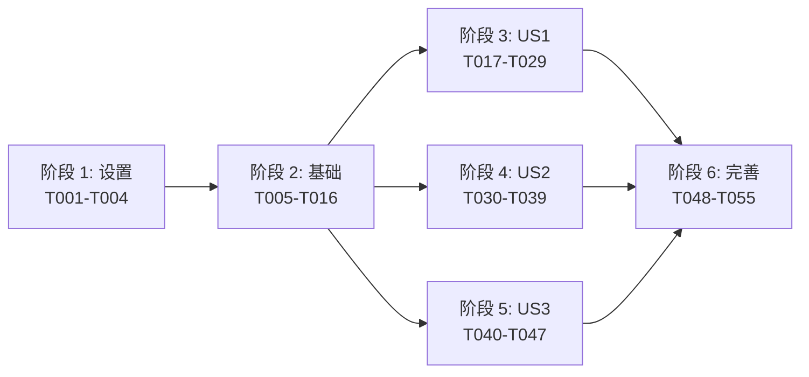

# 任务: 处理流程规范化（Workflow Standardization）

**输入**: 来自 `/specs/018-workflow-standardization/` 的设计文档
**前置条件**: plan.md ✅ spec.md ✅ research.md ✅ data-model.md ✅ contracts/ ✅ quickstart.md ✅

**测试**: 本 Feature **需要**合约测试与关键集成测试（章程原则 II / IX 强制）；单元测试仅对钩子、降级判定、YAML 解析等高风险路径编写。

**组织结构**: 按用户故事 US1（P1 MVP）/ US2（P2）/ US3（P3）分阶段组织，每个故事可独立实施、独立测试、独立交付。

## 格式: `[ID] [P?] [Story] 描述（含文件路径）`
- **[P]**: 可并行运行（不同文件、无未完成依赖）
- **[Story]**: US1 / US2 / US3；设置、基础、收尾阶段不带 Story 标签
- 所有路径均为仓库根目录的绝对路径前缀 `src/` / `tests/` / `scripts/` / `config/` / `docs/`

## 路径约定
- 单一后端服务：`src/` + `tests/`（章程附加约束「路径约定」）
- 无前端代码（章程附加约束「范围边界」）
- Python 环境：`/opt/conda/envs/coaching/bin/python3.11`（章程附加约束「Python 环境隔离」）

---

## 阶段 1: 设置（共享基础设施）

**目的**: 创建 Feature-018 的文件骨架与静态配置，为后续三个故事阶段的并行开工铺路。

- [ ] T001 创建 `scripts/audit/__init__.py`（空包标记）+ 确认 `scripts/` 目录已在 `pyproject.toml` 的 packages / `setup.py` 中可被 `python -m scripts.audit.*` 寻址（不可 ⇒ 补 `pyproject.toml` namespace 包声明）；同步创建 `scripts/audit/_spec_sections.py`，声明模块级常量 `REQUIRED_BUSINESS_STAGE_FIELDS: tuple[str, ...] = ("所属阶段", "所属步骤", "DoD 引用", "可观测锚点", "章程级约束影响", "回滚剧本")`（Clarification Q8 — 六项子标签字面量的单一事实来源，禁止在 `spec_compliance.py` / `workflow_drift.py` 内硬编码这六个字符串）；**自检：`.specify/templates/spec-template.md` 当前已含「业务阶段映射」小段且六项子标签与此常量完全一致 ✅（Feature-018 无需修改模板；若未来常量集合变化，MUST 同步修订模板否则 `workflow_drift` 会失败）**
- [ ] T002 [P] 创建 `scripts/audit/.scan-exclude.yml`，初始内容列入 17 个历史 Feature 目录（`specs/001-*/` ~ `specs/017-*/`），格式：`exclude_paths: [<dir>, ...]` + `schema_version: 1`
- [ ] T003 [P] 创建 `config/optimization_levers.yml`，按 [data-model.md § 6](./data-model.md) 的完整 schema 填充 9 条初始条目（4 runtime_params / 4 algorithm_models / 1 rules_prompts / 4 sensitive）
- [X] T004 [P] 在 `pyproject.toml` 的 `[tool.poetry.dependencies]` / `[project.dependencies]` 验证 PyYAML 已存在（项目应已有；若无 ⇒ 添加 `pyyaml = "^6.0"` 并锁定版本，符合章程附加约束「Python 环境隔离」）

---

## 阶段 2: 基础（阻塞前置条件）

**目的**: 建立所有故事共享的核心基础设施——4 表双列迁移、枚举、ORM 钩子、错误码集中注册。**US1 / US2 / US3 全部依赖本阶段完成**。

**⚠️ 关键**: 在此阶段完成前，**无法开始任何用户故事工作**。

### 数据模型与迁移

- [ ] T005 在 `src/models/analysis_task.py` 新增 `business_phase: Mapped[BusinessPhase]` + `business_step: Mapped[str]` 两列（含 `Enum(business_phase_enum, name=..., create_type=False)` + `String(64)`），并在模块顶部定义 `class BusinessPhase(str, enum.Enum): TRAINING / STANDARDIZATION / INFERENCE`
- [ ] T006 [P] 在 `src/models/extraction_job.py` 新增 `business_phase` + `business_step` 两列
- [ ] T007 [P] 在 `src/models/video_preprocessing_job.py` 新增 `business_phase` + `business_step` 两列
- [ ] T008 [P] 在 `src/models/tech_knowledge_base.py` 新增 `business_phase` + `business_step` 两列
- [ ] T009 创建 `src/models/_phase_step_hook.py`，实现 [data-model.md § 4](./data-model.md) 的 `_TABLE_DEFAULTS` 派生表、`_derive_for_analysis_task()` 派生函数、`_assign_phase_step()` before_insert 处理器、`register_phase_step_hooks()` 集中注册函数；依赖 T005–T008
- [ ] T010 在 `src/db/session.py` 模块顶部（`Base = declarative_base()` 之后）追加 `from src.models._phase_step_hook import register_phase_step_hooks; register_phase_step_hooks()`；确保 API / Celery / Alembic 三种加载入口都会触发一次
- [ ] T011 创建 Alembic 迁移 `src/db/migrations/versions/0016_business_phase_step.py`（当前 head 为 `0015_kb_audit_and_expand_action_types`，新迁移顶层顺延为 0016；**并行开发兑底：若合并前发现 master 已存在同号迁移，MUST 执行 `alembic merge heads` 或重命名为下一个可用编号**），`upgrade()` 按 [data-model.md § 5](./data-model.md) 五步：创建 enum → ADD COLUMN（NULL） → 回填 UPDATE → ALTER NOT NULL → 创建 2 个索引；`downgrade()` 反向五步；`revision = "0016"` / `down_revision = "0015"`

### 错误码登记

- [ ] T012 [P] 在 `src/api/errors.py::ErrorCode` 枚举追加 3 个成员：`INVALID_PHASE_STEP_COMBO` / `PHASE_STEP_UNMAPPED` / `OPTIMIZATION_LEVERS_YAML_INVALID`；同步补齐 `ERROR_STATUS_MAP`（400 / 500 / 500）与 `ERROR_DEFAULT_MESSAGE`，严格按 [contracts/error-codes.md](./contracts/error-codes.md) 的 Python 补丁落位

### 测试夹具与基线

- [ ] T013 [P] 在 `tests/conftest.py` 中新增/扩展 `clean_db_with_phase_step` fixture（或在已有 `clean_db` fixture 中确认 alembic upgrade head 覆盖了 0016 迁移，便于后续集成测试启动时表结构齐备）

### 基础阶段单元测试（先写先失败）

- [ ] T014 [P] 在 `tests/unit/models/test_phase_step_hook.py` 编写 ORM 钩子单元测试：覆盖 7 个场景（analysis_tasks 四种 task_type 自动派生、extraction_jobs 固定派生、显式传入 phase+step 被尊重、只传 phase 未传 step 抛 `ValueError("PHASE_STEP_UNMAPPED...")`、未知 task_type 抛 `PHASE_STEP_UNMAPPED`、`parent_scan_task_id IS NULL` → scan_cos_videos、`parent_scan_task_id NOT NULL` → classify_video）
- [ ] T015 [P] 在 `tests/integration/test_phase_step_migration.py` 编写迁移集成测试：`alembic downgrade -2 && alembic upgrade head` 后校验四表 NULL 率 = 0%，enum type 存在，2 个索引存在

### 基础实现验收

- [ ] T016 运行 `/opt/conda/envs/coaching/bin/python3.11 -m pytest tests/unit/models/test_phase_step_hook.py tests/integration/test_phase_step_migration.py -v`，确认全部通过（T014 / T015 由 Red → Green）

**检查点**: 基础就绪——四张业务表已具备 `business_phase` / `business_step` 双列 + NOT NULL 约束 + ORM 钩子 + 索引 + 错误码登记。US1 / US2 / US3 现在可以并行开始。

---

## 阶段 3: 用户故事 1 — 按业务阶段/步骤查询任务与作业（优先级: P1）🎯 MVP

**目标**: 为运营/教练团队提供"某阶段目前有哪些任务在跑 / 积压在哪里"的统一视图——通过 `GET /api/v1/business-workflow/overview` 一次性返回三阶段八步骤全景，并在现有列表接口（`/tasks` / `/extraction-jobs` / `/knowledge-base/versions`）扩展 `?business_phase=` / `?business_step=` 过滤。

**独立测试**: 在一个仅含三种状态示例数据的 staging 环境，调用 `/overview` 得到三阶段聚合；调用 `/tasks?business_phase=TRAINING&business_step=extract_kb` 得到抽取任务列表；调用非法组合 `?business_phase=INFERENCE&task_type=kb_extraction` 得到 400 `INVALID_PHASE_STEP_COMBO`；通过 PostgreSQL 规模模拟（临时 `UPDATE pg_class SET reltuples=1_500_000 WHERE relname='analysis_tasks'`）触发降级档并观察 `meta.degraded=true`。无需触碰 US2 / US3 任何代码。

### US1 合约测试（TDD Red-Green 前置，原则 II）⚠️

> **先编写这些测试并确认失败，再进入实现任务**

- [ ] T017 [P] [US1] 在 `tests/contract/test_business_workflow_overview_contract.py` 编写合约测试：覆盖 200 完整档 schema、200 降级档 schema（mock `pg_class.reltuples > 1_100_000`）、400 `window_hours=200` → `INVALID_ENUM_VALUE`；字段集严格匹配 [contracts/business-workflow-overview.yaml](./contracts/business-workflow-overview.yaml)
- [ ] T018 [P] [US1] 在 `tests/contract/test_tasks_phase_step_filter_contract.py` 编写合约测试：覆盖 `?business_phase=TRAINING`、`?business_step=extract_kb`、`?business_phase=INFERENCE&task_type=kb_extraction` → 400 `INVALID_PHASE_STEP_COMBO`、`?business_phase=INVALID` → 400 `INVALID_ENUM_VALUE`

### US1 集成测试

- [ ] T019 [P] [US1] 在 `tests/integration/test_workflow_overview_degradation.py` 编写端到端集成测试：
  - happy_path：构造 3 阶段各 5 行样本数据 → 调 `/overview` → 校验 `meta.degraded=false` + `data.TRAINING.steps.extract_kb.success == 5`
  - degraded_path：通过 monkeypatch mock `pg_class.reltuples` 返回 1_500_000 → 调 `/overview` → 校验 `meta.degraded=true` + step 内 `p50_seconds` / `p95_seconds` 字段不存在

### US1 Schema 层

- [ ] T020 [P] [US1] 创建 `src/api/schemas/business_workflow.py`，实现 [data-model.md § 7](./data-model.md) 的 `StepSnapshot` / `PhaseSnapshot` / `WorkflowOverviewSnapshot` / `WorkflowOverviewMeta` 四个 Pydantic v2 模型（`model_config = ConfigDict(extra="forbid")`）

### US1 Service 层

- [ ] T021 [US1] 创建 `src/services/business_workflow_service.py`，实现 `WorkflowOverviewService`：
  - `async def get_overview(session, window_hours: int) -> tuple[WorkflowOverviewSnapshot, WorkflowOverviewMeta]`
  - 先查 `pg_class.reltuples`，> 1_100_000 ⇒ 进入降级模式（跳过 p50/p95 计算）
  - 完整模式下：基于 `idx_analysis_tasks_phase_step` + `idx_extraction_jobs_phase` 的 `GROUP BY business_phase, business_step, status` 聚合 + 子查询 `percentile_cont(0.5/0.95) WITHIN GROUP (ORDER BY EXTRACT(EPOCH FROM (completed_at - started_at)))`
  - 返回 `generated_at = datetime.now(tz=ZoneInfo("Asia/Shanghai"))`
- [ ] T022 [US1] 在 `src/services/business_workflow_service.py` 追加 `_validate_phase_step_task_type_combo(phase, step, task_type)` 校验函数（基于 [research.md R6](./research.md) 的校验矩阵），矛盾时 `raise AppException(ErrorCode.INVALID_PHASE_STEP_COMBO, details={...})`

### US1 路由层

- [ ] T023 [US1] 创建 `src/api/routers/business_workflow.py`：`APIRouter(prefix="/business-workflow", tags=["business-workflow"])`，实现 `GET /overview` 路由，`response_model=SuccessEnvelope[WorkflowOverviewSnapshot]`；`window_hours: int = Query(default=24, ge=1, le=168)`；直接构造 `SuccessEnvelope(success=True, data=..., meta=WorkflowOverviewMeta(...).model_dump())`
- [ ] T024 [US1] 在 `src/api/main.py::create_app()` 追加 `from src.api.routers import business_workflow; app.include_router(business_workflow.router, prefix="/api/v1")`
- [ ] T025 [P] [US1] 在 `src/api/routers/tasks.py::list_tasks` 扩展查询参数 `business_phase: str | None = Query(default=None)` + `business_step: str | None = Query(default=None)`；在 service 层调用 `_validate_phase_step_task_type_combo`；service 的 `WHERE` 子句追加 `AND business_phase = :phase AND business_step = :step`（仅当参数非空时）
- [ ] T026 [P] [US1] 在 `src/api/routers/extraction_jobs.py::list_extraction_jobs` 扩展同样的查询参数（但 extraction_jobs 的 phase/step 恒定为 `TRAINING/extract_kb`，仅做参数一致性校验，不改变 WHERE 逻辑）
- [ ] T027 [P] [US1] 在 `src/api/routers/knowledge_base.py::list_versions` 扩展 `business_phase: str | None`（knowledge_base 的 phase 恒为 STANDARDIZATION，按同上策略处理）

### US1 验收

- [ ] T028 [US1] 运行 US1 合约 + 集成测试：`/opt/conda/envs/coaching/bin/python3.11 -m pytest tests/contract/test_business_workflow_overview_contract.py tests/contract/test_tasks_phase_step_filter_contract.py tests/integration/test_workflow_overview_degradation.py tests/unit/services/test_business_workflow_service.py -v`
- [ ] T029 [US1] 按 [quickstart.md § 2–3](./quickstart.md) 手工冒烟：启动 API → 验证完整档 / 降级档 / 过滤 / 非法组合四个场景的 curl 响应

**检查点**: 此时 US1 已完全功能化，作为 Feature-018 MVP 可独立部署演示；运营可通过 `/overview` 看到三阶段全景。US2 / US3 可继续或并行推进。

---

## 阶段 4: 用户故事 2 — 章程级约束与业务流程文档双向同步的 CI 守卫（优先级: P2）

**目标**: 避免"代码改了文档没改"或"新增错误码 / 状态机枚举 / 队列配置漏登记到 `docs/business-workflow.md`"的漂移——通过两个 CLI 脚本 `workflow_drift.py` + `spec_compliance.py` 在本地与 CI 双层闸门运行，违规硬失败（**不引入 waiver**，Clarification Q5）。

**独立测试**: 本地改一处 `ALL_ERROR_CODES` 加一个文档未登记的 code → 跑 `--full` 扫描 → exit 1 且打印 `DRIFT: error_code_prefix WHISPER_GPU_OOM code_side=present doc_side=missing`；删除该 code → 跑 → exit 0；新建一个 `specs/019-fake/spec.md` **不写**「业务阶段映射」小段 → 跑 `spec_compliance --full` → exit 1；写上合规小段 → exit 0。

### US2 单元测试（TDD 前置）⚠️

- [ ] T030 [P] [US2] 在 `tests/unit/audit/test_workflow_drift_parser.py` 编写 markdown anchored-section 解析单元测试：给定固定的 mini 版 `business-workflow.md` fixture，验证 `_parse_section_table(text, "§ 7.4")` 正确抽取第一列
- [ ] T031 [P] [US2] 在 `tests/unit/audit/test_spec_compliance_checker.py` 编写合规检查单元测试：given 三个 mini spec.md 样本（含段 / 缺段 / 段名称错别字），`check_spec_file(path)` 返回预期 `MissingSection` 列表
- [ ] T031b [P] [US2] 在 `tests/unit/audit/test_spec_template_drift.py` 编写模板漂移单元测试（Clarification Q8）：mock `.specify/templates/spec-template.md` 文本中缺失一项子标签（如删掉「回滾剧本」一行），断言 `workflow_drift.py` 输出 `DRIFT: spec_template_fields 回滾剧本 code_side=present doc_side=missing`；补充反向用例：模板完整 ⇒ 该类零输出

### US2 集成测试（端到端）

- [ ] T032 [US2] 在 `tests/integration/test_drift_scan_end_to_end.py` 编写端到端测试：
  - 场景 A（无漂移）：用项目当前文件跑 `--full`，exit 0
  - 场景 B（注入漂移）：临时 monkeypatch `ALL_ERROR_CODES` 添加 `WHISPER_GPU_OOM`，跑 `--full`，exit 1 且 stdout 含 `DRIFT: error_code_prefix WHISPER_GPU_OOM`
  - 场景 C（--changed-only，文档改动）：mock `git diff --name-only` 返回仅含 `docs/business-workflow.md`，跑 `--changed-only`，触发文档整体扫描
  - 场景 D（--changed-only，无命中）：mock 返回仅含 `README.md`，跑 `--changed-only`，打印 `no target in diff`，exit 0

### US2 脚本实现

- [ ] T033 [US2] 创建 `scripts/audit/workflow_drift.py`：
  - 入口 `if __name__ == "__main__": main()`；argparse 支持 `--full` / `--changed-only` / `--commit-range=<ref...ref>`
  - 代码侧采集：import `src.services.kb_extraction_pipeline.error_codes::ALL_ERROR_CODES`、`src.models.analysis_task::TaskStatus/TaskType`、`src.models.extraction_job::ExtractionJobStatus`、`src.models.tech_knowledge_base::KBStatus`、扫 `src/db/migrations/versions/*_task_pipeline_redesign.py` + `0014_video_preprocessing_pipeline.py` 的 `task_channel_configs` seed 值、读取 `config/optimization_levers.yml` 的 `key` 列表
  - 文档侧采集：`_parse_section_table(Path("docs/business-workflow.md").read_text(), "§ 7.4")` 类似接口，切片 § 2 / § 3.1 / § 4.3 / § 5.1 / § 5.3 / § 7.4 / § 9
  - 模板侧采集（Clarification Q8 / `DriftReport.kind=spec_template_fields`）：`from scripts.audit._spec_sections import REQUIRED_BUSINESS_STAGE_FIELDS`；读取 `.specify/templates/spec-template.md`，若文件缺失"业务阶段映射"小段或六项子标签与常量字符集不一致 ⇒ 输出 `DRIFT: spec_template_fields <missing_or_extra_field>`
  - 计算代码 → 文档的集合差（单向语义，FR-011）；输出按 [research.md R7](./research.md) + [data-model.md § 9](./data-model.md) 的退出码与格式（`DriftReport.kind` 需支持 `error_code_prefix` / `task_status_enum` / `extraction_job_status` / `kb_status` / `scorer_threshold` / `channel_seed` / `optimization_lever` / `spec_template_fields` 共 8 种取值）
  - `--changed-only` 使用 `subprocess.run(["git", "diff", "--name-only", commit_range], check=True, capture_output=True, text=True)`；匹配代码侧白名单路径（硬编码，涵盖 `config/optimization_levers.yml` + `.specify/templates/spec-template.md` + `scripts/audit/_spec_sections.py`） + 文档路径（整体扫描）

- [ ] T034 [US2] 创建 `scripts/audit/spec_compliance.py`：
  - 遍历 `specs/*/spec.md`，排除 `.scan-exclude.yml` 列出的历史 17 目录
  - `from scripts.audit._spec_sections import REQUIRED_BUSINESS_STAGE_FIELDS`（Clarification Q8 — 禁止硬编码六项字符串字面量）
  - 对每个 spec.md 检查是否包含「业务阶段映射」小段 + `REQUIRED_BUSINESS_STAGE_FIELDS` 全部 6 项子标签
  - 支持 `--full` / `--changed-only`；违规行格式 `MISSING_SECTION: specs/019-xxx/spec.md 业务阶段映射` 或 `MISSING_FIELD: specs/019-xxx/spec.md <field_name>`
  - 退出码与 workflow_drift 一致

- [ ] T035 [US2] 在 `scripts/audit/` 新增 `common.py`（或直接置于两个脚本内）实现共享的：`load_scan_exclude() -> set[Path]`、`get_changed_files(commit_range) -> list[Path]`、`emit_drift(kind, identifier, code_side, doc_side)` 输出格式化器

### US2 CI 集成（文档化）

- [ ] T036 [P] [US2] 在 `docs/business-workflow.md` § 7 末尾追加子节 § 7.7「CI 守卫」简述两个脚本的调用与退出码；通过 refresh-docs skill 完整化或手工编辑后 lint（不能破坏现有锚点：§ 7.5「建议补强的三类指标」/ § 7.6「业务阶段总览」均需保留）
- [ ] T037 [US2] 按 Clarification Q6（选项 A — 不引入托管 CI 平台配置）落地本地双层守卫：
  - 仓库根新建 `Makefile`，声明 3 个目标：`make drift-changed`（= `$PYBIN -m scripts.audit.workflow_drift --changed-only && $PYBIN -m scripts.audit.spec_compliance --changed-only`）、`make drift-full`（= 两个脚本 `--full`）、`make spec-compliance`（单独跑 `spec_compliance.py --full`）；`PYBIN ?= /opt/conda/envs/coaching/bin/python3.11`（允许环境变量覆盖）
  - 新建 `scripts/git-hooks/pre-push`（shell 脚本，带 shebang + `set -euo pipefail`），内容调用 `make drift-changed`；violating ⇒ `exit 1` 阻断 push
  - 新建 `scripts/install-git-hooks.sh`（幂等），把 `.git/hooks/pre-push` 软链（`ln -sfn ../../scripts/git-hooks/pre-push`）到仓库内脚本；研发首次 clone 后执行一次即可
  - **不新增** `.github/workflows/` 目录，**不新增** `.gitlab-ci.yml` / `Jenkinsfile`；未来引入任意托管 CI 平台时，仅需在对应配置中调用 `make drift-full` + `make spec-compliance` 两个目标即可对接（YAGNI，原则 IV）

### US2 验收

- [ ] T038 [US2] 按 [quickstart.md § 5–6](./quickstart.md) 本地完整走通：`make drift-full` → exit 0；`make spec-compliance` → exit 0；注入一次漂移（如临时改一处错误码）验证 `make drift-full` exit 1；执行 `bash scripts/install-git-hooks.sh` 后 `.git/hooks/pre-push` 软链生效，注入漂移 `git push` 被 `make drift-changed` 阻断
- [ ] T039 [US2] 运行 `/opt/conda/envs/coaching/bin/python3.11 -m pytest tests/unit/audit/ tests/integration/test_drift_scan_end_to_end.py -v`，全部绿

**检查点**: 此时 US2 独立交付——任何未同步的章程级约束变更会在 PR 阶段被硬失败，`specs/019+` 新 Feature 必须包含「业务阶段映射」小段。

---

## 阶段 5: 用户故事 3 — 优化杠杆入口统一台账（优先级: P3）

**目标**: 给运维/SRE 一个"调参入口字典"——通过 `GET /api/v1/admin/levers` 一次性拿到 § 9 三类杠杆（运行时参数 / 算法模型 / 规则与 Prompt）的当前值、生效路径、重启范围；敏感键仅返回 `is_configured`。

**独立测试**: 启动 API → `curl -H "X-Admin-Token: $TOKEN" /api/v1/admin/levers` → 返回三组分类；验证 `VENUS_TOKEN` 条目含 `is_configured: true` 但不含 `current_value`；验证 `POSE_BACKEND` 条目含 `current_value: "auto"`；删除 `.env` 中的 `VENUS_TOKEN` → 重启 → 条目变为 `is_configured: false`。

### US3 合约测试（TDD 前置）⚠️

- [ ] T040 [P] [US3] 在 `tests/contract/test_admin_levers_contract.py` 编写合约测试：200 响应含 `runtime_params` / `algorithm_models` / `rules_prompts` 三个 array；敏感键 schema 有 `is_configured` 无 `current_value`；非敏感键相反；401 `ADMIN_TOKEN_INVALID`；500 `ADMIN_TOKEN_NOT_CONFIGURED`（fail-safe）；严格匹配 [contracts/admin-levers.yaml](./contracts/admin-levers.yaml)

### US3 单元测试

- [ ] T041 [P] [US3] 在 `tests/unit/services/test_optimization_levers_service.py` 编写：
  - 合法 YAML 加载成功；schema 违规（`type: foo`）抛 `AppException(OPTIMIZATION_LEVERS_YAML_INVALID)`
  - 敏感键返回值 `current_value is None` / `is_configured in {True, False}`
  - 非敏感键返回值 `is_configured is None` / `current_value` 存在
  - `?phase=INFERENCE` 过滤正确（条目 `business_phase` 含 INFERENCE 时返回）

### US3 Schema 层

- [ ] T042 [P] [US3] 创建 `src/api/schemas/admin_levers.py`，实现 [data-model.md § 8](./data-model.md) 的 `LeverEntry` + `LeverGroups` Pydantic v2 模型

### US3 Service 层

- [ ] T043 [US3] 创建 `src/services/optimization_levers_service.py`，实现 `OptimizationLeversService`：
  - `__init__`：加载 `config/optimization_levers.yml` 并走 schema 校验（失败抛 `OPTIMIZATION_LEVERS_YAML_INVALID`）；启动时 fail-fast
  - `async def list_levers(session, phase: BusinessPhase | None) -> LeverGroups`：
    - 对 `source=db_table` 条目：查 `task_channel_configs` 取当前值
    - 对 `source=env` 条目：读 `get_settings().<field>` 或 `os.environ.get(key)`
    - 对 `source=config_file` 条目：读文件 sha256 摘要作为 "loaded (hash=sha256:..)"
    - 敏感键：`current_value` 置 None，`is_configured = bool(raw_value)`
    - 非敏感键：`current_value` 填充，`is_configured = None`
  - 单例：在 `src/api/main.py::create_app()` 启动时构造一次并注入 `app.state.levers_service`

### US3 路由层

- [ ] T044 [US3] 在 `src/api/routers/admin.py` 追加 `GET /admin/levers` 路由，`response_model=SuccessEnvelope[LeverGroups]`；复用 `_verify_admin_token(request.headers.get("X-Admin-Token"))`；`phase: str | None = Query(default=None)` 用 `parse_enum_param(phase, field="phase", enum_cls=BusinessPhase)`；返回 `ok(await svc.list_levers(db, phase))`
- [ ] T045 [US3] 在 `src/api/main.py::create_app()` 启动钩子处初始化 `OptimizationLeversService()`（fail-fast）

### US3 验收

- [ ] T046 [US3] 运行 US3 测试：`/opt/conda/envs/coaching/bin/python3.11 -m pytest tests/contract/test_admin_levers_contract.py tests/unit/services/test_optimization_levers_service.py -v`
- [ ] T047 [US3] 按 [quickstart.md § 4](./quickstart.md) 手工冒烟：用 `X-Admin-Token` 成功拿三组杠杆；不带 token 收到 401；`?phase=TRAINING` 过滤生效；敏感键仅 `is_configured`

**检查点**: 此时 US3 独立交付——运维可在一个接口内看到所有调参入口，敏感信息零泄露。

---

## 阶段 6: 完善与横切关注点

**目的**: 跨 US1 / US2 / US3 的收尾——文档同步、性能验证、章程合规闭环。

- [ ] T048 [P] 执行 `refresh-docs` skill 刷新 `docs/architecture.md` / `docs/features.md` / `docs/business-workflow.md`：新增 § 7.6「业务阶段总览接口」子节（US1）、§ 7.7「CI 守卫」子节（US2）、§ 9 表格追加“运维入口：`GET /api/v1/admin/levers`”（US3）
- [ ] T049 [P] 在 `docs/business-workflow.md` § 4.3 状态机、§ 5.1 通道清单、§ 7.4 错误码表、§ 5.3 诊断评分公式四处 anchored-section 追加脚注 `（由 scripts/audit/workflow_drift.py 守护，不同步会在 CI 失败）`
- [ ] T050 性能验证（SC-003）：准备 80 万 + 行的 `analysis_tasks` 样本（可用 `INSERT INTO ... SELECT generate_series(...)` 构造），`ab -n 200 -c 20 -H "..." http://localhost:8080/api/v1/business-workflow/overview` 连测 3 轮，记录 P95 / P99，附 `specs/018-workflow-standardization/benchmarks/overview_latency.md`（若 docs/benchmarks/ 已有则顺移过去）
- [ ] T051 [P] 运行全量测试套件：`/opt/conda/envs/coaching/bin/python3.11 -m pytest tests/ -v`，0 失败；并运行项目既有的合约测试套件（Feature-017）确认未回退
- [ ] T052 [P] 运行 `$PYBIN -m scripts.audit.workflow_drift --full` + `$PYBIN -m scripts.audit.spec_compliance --full` 自扫描本 Feature 的 018 合规
- [ ] T053 按 [quickstart.md](./quickstart.md) 全文从 § 0 到 § 10 走一遍，校正任何与实际实现不一致的 curl 命令或示例响应
- [ ] T054 在 `specs/018-workflow-standardization/` 下新增 `CHANGELOG.md`（可选），记录自 spec → plan → tasks → implement 全周期的关键节点；或用 git log 导出附在 `quickstart.md` 末尾
- [ ] T055 安全加固：在 `src/services/optimization_levers_service.py` 审计一遍所有 `current_value` 返回路径，确保敏感键零泄露；补一条 `tests/unit/services/test_optimization_levers_service.py::test_no_sensitive_leak` 白盒测试（对比 `LeverEntry.model_dump()` 字段集）

**最终验收**: 执行 `/speckit.analyze`（`handoffs.label=一致性分析`）做规范 ↔ 计划 ↔ 任务 ↔ 实现四方一致性复核；无致命发现后合并本分支。

---

## 依赖关系与执行顺序

### 阶段依赖关系



- **设置（阶段 1）**: 无依赖 - 可立即开始
- **基础（阶段 2）**: 依赖设置完成 - 阻塞所有用户故事
- **用户故事（阶段 3 / 4 / 5）**: 都依赖阶段 2 完成
  - US1 / US2 / US3 相互独立，三团队可并行
  - 单人顺序推进时按 P1 → P2 → P3
- **完善（阶段 6）**: 依赖所有期望用户故事完成

### 用户故事依赖关系

- **US1（P1 MVP）**: 阶段 2 完成后可独立开始；**无**跨故事依赖
- **US2（P2）**: 阶段 2 完成后可独立开始；不依赖 US1 的接口实现（扫描的是仓库源码，不是 API）
- **US3（P3）**: 阶段 2 完成后可独立开始；可选择复用 `_verify_admin_token`（US3 之前已由 Feature-017 落位），无 US1 / US2 依赖

### 每个用户故事内部

- 合约测试（TDD Red）先于路由实现
- Pydantic Schema（schemas/）先于 Service
- Service 先于 Router
- Router 实现后并入 `src/api/main.py::create_app()`
- 单个故事完成后才推进到下一优先级

### 并行机会

**阶段 1 内**: T002 / T003 / T004 三个任务并行（都带 [P]）

**阶段 2 内**:
- T006 / T007 / T008 三个 ORM 表增列任务并行（不同文件）
- T012（errors.py）与 T013（conftest）并行
- T014 / T015 两个基础测试并行编写

**阶段 3（US1）内**:
- T017 / T018 / T019 三个测试任务并行
- T025 / T026 / T027 三个既有路由扩展并行（不同文件）

**阶段 4（US2）内**:
- T030 / T031 两个单元测试并行
- T036 文档编辑与 T037 CI 配置并行

**阶段 5（US3）内**:
- T040 / T041 测试任务并行
- T042 Schema 与 T043 Service 可并行（T042 仅提供类型，T043 import）

**阶段 6 内**: T048 / T049 / T051 / T052 / T055 全部 [P] 并行

---

## 并行示例: 用户故事 1

```bash
# 一起启动 US1 的测试编写（三人协作）
任务: "在 tests/contract/test_business_workflow_overview_contract.py 编写 overview 合约测试"
任务: "在 tests/contract/test_tasks_phase_step_filter_contract.py 编写 tasks 过滤合约测试"
任务: "在 tests/integration/test_workflow_overview_degradation.py 编写降级集成测试"

# 一起扩展既有路由（三文件互不干扰）
任务: "在 src/api/routers/tasks.py::list_tasks 扩展 ?business_phase / ?business_step 查询参数"
任务: "在 src/api/routers/extraction_jobs.py::list_extraction_jobs 扩展同样参数"
任务: "在 src/api/routers/knowledge_base.py::list_versions 扩展 ?business_phase 参数"
```

## 并行示例: 用户故事 2

```bash
# 一起启动 US2 的单元测试
任务: "在 tests/unit/audit/test_workflow_drift_parser.py 编写 markdown 解析单测"
任务: "在 tests/unit/audit/test_spec_compliance_checker.py 编写合规检查单测"
```

## 并行示例: 用户故事 3

```bash
# Schema 与 Service 同步开写（Service import Schema 类型）
任务: "创建 src/api/schemas/admin_levers.py（LeverEntry / LeverGroups）"
任务: "创建 src/services/optimization_levers_service.py（加载 YAML + 敏感过滤）"
```

---

## 实施策略

### 仅 MVP（仅 US1）

1. 完成阶段 1：设置（T001–T004）
2. 完成阶段 2：基础（T005–T016，**关键 — 阻塞所有故事**）
3. 完成阶段 3：US1（T017–T029）
4. **停止并验证**：独立冒烟 `/overview` 与 `?business_phase=` 过滤；运营团队上线使用
5. 采集两周使用反馈后，再决定是否推进 US2 / US3

### 增量交付

1. 设置 + 基础 → 基础就绪
2. US1 → 独立验证 → 部署（**MVP**！运营看到阶段全景）
3. US2 → 独立验证 → 部署（CI 守卫生效，防止文档漂移）
4. US3 → 独立验证 → 部署（运维拿到调参台账）
5. 阶段 6 → 最终整理，刷新文档，性能基线入档

### 并行团队策略

3 人团队：

1. 团队一起完成阶段 1 + 阶段 2（2 天）
2. 基础完成后：
   - **后端 A**（资深）：US1（T017–T029）— 9 个实现任务 + 3 个测试
   - **后端 B**（中级）：US2（T030–T039）— 脚本 + CI 集成
   - **后端 C**（中级）：US3（T040–T047）— 较独立，接口 + YAML
3. 3 个故事独立测试后统一在阶段 6 收尾

---

## 注意事项

- `[P]` 任务 = 不同文件、无未完成依赖
- `[Story]` 标签 = US1 / US2 / US3，便于追踪映射到 spec.md 用户故事
- 每个用户故事独立可完成、可测试、可单独部署演示
- **TDD 强制**：所有合约测试必须在路由实现前编写并观察 Red → 实现后 Green（章程原则 II + IX）
- **禁止 waiver**：扫描脚本无运行期豁免机制，违规通过"修订集中清单或补全文档"的原子 PR 解决（Clarification Q5）
- 每个任务或逻辑组完成后 MUST 提交 git，提交消息引用 T### ID
- 在每个 **检查点** 可停下独立验证，不强求一气呵成
- 避免：模糊任务描述、同文件内并行写入、破坏故事独立性的跨故事依赖

---

## 格式验证（生成后自检）

- [x] 所有任务遵循 `- [ ] T### [P?] [Story?] 描述（含文件路径）` 格式
- [x] 每个任务有唯一 ID（T001–T055）
- [x] `[P]` 标记仅加在"不同文件、无未完成依赖"的任务上
- [x] `[Story]` 标签仅在阶段 3 / 4 / 5 内出现；阶段 1 / 2 / 6 无 Story 标签
- [x] 所有任务含明确文件路径（`src/` / `tests/` / `scripts/` / `config/` / `docs/`）
- [x] US1 / US2 / US3 各自可独立测试（见每阶段的"独立测试"段）
