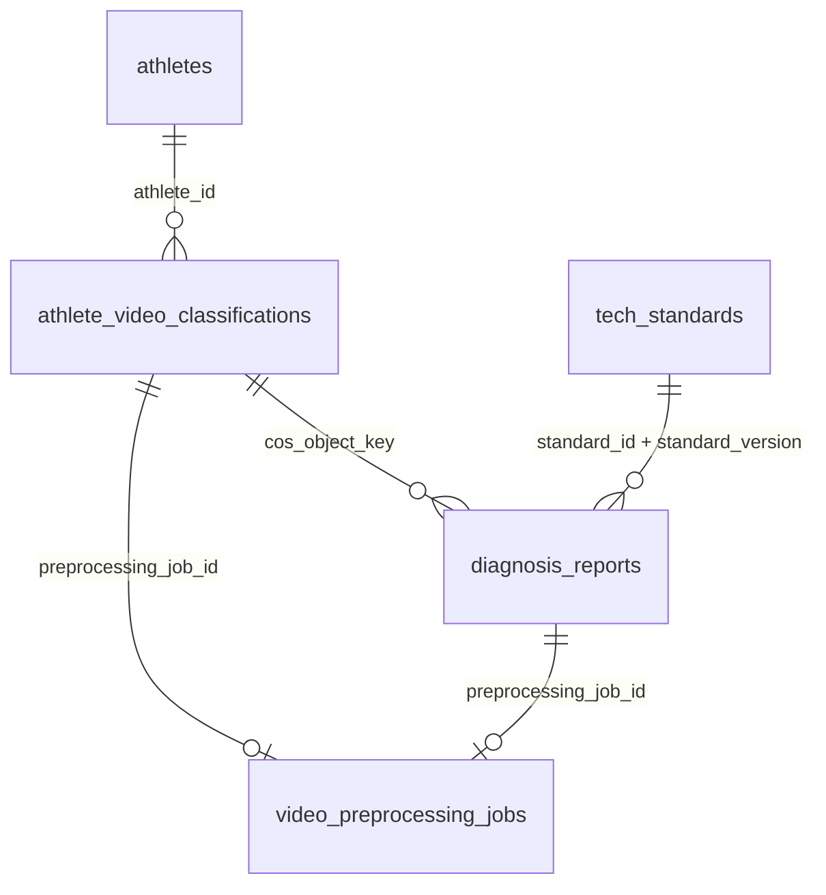

# 数据模型: 运动员推理流水线

**Feature**: 020-athlete-inference-pipeline
**日期**: 2026-04-30
**迁移**: `0018_athlete_inference_pipeline`（下游于 `0017_kb_per_category_redesign`）

---

## 1. 实体总览



本 feature 新增两张表 `athletes` / `athlete_video_classifications`，并扩 `diagnosis_reports` 三列用作反查锚点。与教练侧表（`coaches` / `coach_video_classifications`）**物理隔离、禁止合表**（章程附加约束 + SC-006）。

---

## 2. 表 · `athletes`

**定位**：与 `coaches` 结构对称，记录独立运动员实体。由 `CosAthleteScanner._upsert_athlete()` 在扫描运动员 COS 根路径时自动同步；无额外维护入口（本 feature 不提供运动员 CRUD）。

| 列名 | 类型 | 约束 | 说明 |
|------|------|------|------|
| `id` | UUID | PK，`DEFAULT gen_random_uuid()` | — |
| `name` | `VARCHAR(100)` | NOT NULL, UNIQUE | 去重键；同名冲突由 scanner 加 `_2 / _3` 后缀后再插入 |
| `bio` | `TEXT` | NULL | 回填源：对应 COS 目录名；已有值不覆盖 |
| `created_via` | `VARCHAR(20)` | NOT NULL, `DEFAULT 'athlete_scan'` | 固定 `athlete_scan`，区分于未来可能的手工入口 |
| `created_at` | `TIMESTAMP WITHOUT TIMEZONE` | NOT NULL, `DEFAULT timezone('Asia/Shanghai', now())` | CST 固化（项目规则） |
| `updated_at` | `TIMESTAMP WITHOUT TIMEZONE` | NOT NULL, `ON UPDATE timezone('Asia/Shanghai', now())` | — |

**索引**：`UNIQUE (name)`（PK 自带；无额外索引）。

**不做什么**：
- 不加 `email / phone / level / membership_*` 等扩展字段（章程原则 IV YAGNI）
- 不加 `coach_id` 外键（运动员 / 教练分别独立实体，两者无业务层强关联）

---

## 3. 表 · `athlete_video_classifications`

**定位**：运动员原始视频素材清单，与 `coach_video_classifications` 在字段结构上**接近对称但独立**（多 `athlete_id` / 少 `kb_extracted`；生命周期终点不同）。

| 列名 | 类型 | 约束 | 说明 |
|------|------|------|------|
| `id` | UUID | PK，`DEFAULT gen_random_uuid()` | — |
| `cos_object_key` | `VARCHAR(1024)` | NOT NULL, **UNIQUE** | 单列 UNIQUE；upsert 主键（Q2 决议） |
| `athlete_id` | UUID | NOT NULL, FK → `athletes.id` ON DELETE RESTRICT | 由 scanner 维护 |
| `athlete_name` | `VARCHAR(100)` | NOT NULL | 反范式快照，便于报表；与 `athletes.name` 一致 |
| `name_source` | `VARCHAR(10)` | NOT NULL, CHECK IN (`'map'`, `'fallback'`) | `map`=命中 `config/athlete_directory_map.json`；`fallback`=回退目录名 |
| `tech_category` | `VARCHAR(50)` | NOT NULL | `TECH_CATEGORIES` 21 类之一（含 `unclassified`） |
| `classification_source` | `VARCHAR(10)` | NOT NULL, CHECK IN (`'rule'`, `'llm'`, `'fallback'`) | — |
| `classification_confidence` | `FLOAT` | NOT NULL | 0.0 ~ 1.0 |
| `preprocessed` | `BOOLEAN` | NOT NULL, `DEFAULT false` | 预处理完成标志位 |
| `preprocessing_job_id` | UUID | NULL, FK → `video_preprocessing_jobs.id` ON DELETE SET NULL | 预处理成功后回写；失败/从未做过则 NULL |
| `last_diagnosis_report_id` | UUID | NULL, FK → `diagnosis_reports.id` ON DELETE SET NULL | 可选的"最后一次诊断报告"引用；每次新诊断都会 upsert |
| `created_at` | `TIMESTAMP WITHOUT TIMEZONE` | NOT NULL, `DEFAULT timezone('Asia/Shanghai', now())` | — |
| `updated_at` | `TIMESTAMP WITHOUT TIMEZONE` | NOT NULL, `ON UPDATE timezone('Asia/Shanghai', now())` | — |

**索引**：
- `UNIQUE (cos_object_key)` — 唯一键兼主 upsert 索引
- `(athlete_id, created_at DESC)` — 按运动员查历史清单（US5 查询路径）
- `(tech_category, created_at DESC)` — 按技术类别批量查待诊断素材
- `(preprocessed, tech_category)` — 快速筛"已预处理且属于某类别"的候诊队列

**状态转移（非状态机字段，但有语义约束）**：
```
初始 scan 插入 → preprocessed=false / preprocessing_job_id=null / last_diagnosis_report_id=null
       ↓
预处理成功   → preprocessed=true, preprocessing_job_id=<job>
       ↓
诊断成功     → last_diagnosis_report_id=<report>（每次覆盖）
```

**不做什么**：
- 不记录 `course_series`（R10 决议）
- 不加 `is_deleted / deleted_at`（Q5 已明确本 feature 不提供遗忘权接口）
- 不与 `coach_video_classifications` 共享任何外键或视图

---

## 4. 表扩展 · `diagnosis_reports`（只增列，不破坏既有）

| 新增列 | 类型 | 约束 | 说明 |
|--------|------|------|------|
| `cos_object_key` | `VARCHAR(1024)` | NULL | 反查锚点之一——素材原始 COS key；F-011/F-013 旧行留 NULL |
| `preprocessing_job_id` | UUID | NULL, FK → `video_preprocessing_jobs.id` ON DELETE SET NULL | 反查锚点之二——预处理 job |
| `source` | `VARCHAR(20)` | NOT NULL, `DEFAULT 'legacy'`, CHECK IN (`'legacy'`, `'athlete_pipeline'`) | 区分诊断报告来源；本 feature 产出的行统一 `athlete_pipeline`；旧行保留 `legacy` |

**新增索引**：
- `(cos_object_key, created_at DESC)` — 按素材查报告按时间倒序（SC-005）
- `preprocessing_job_id` — 单列索引

**既有列复用**：`standard_id` + `standard_version` 是反查锚点之三，**不需新列**。

**不做什么**：
- 不改既有列 NULL/NOT NULL / 默认值 / 类型；原则 IX "已发布接口/字段只允许新增"
- 不删 `strengths_summary` / `overall_score` 等任何字段

---

## 5. `AnalysisTask.task_type` 枚举扩展

现有（`src/models/analysis_task.py::TaskType`）：
```
video_classification
kb_extraction
athlete_diagnosis
video_preprocessing
```

**新增 2 个**：
```
athlete_video_classification      # 运动员素材扫描（单任务 = scan 全量）
athlete_video_preprocessing       # 运动员视频预处理
```

**`_phase_step_hook._derive_for_analysis_task` 派生矩阵新增两行**：
```
athlete_video_classification     → (INFERENCE, scan_athlete_videos)
athlete_video_preprocessing      → (INFERENCE, preprocess_athlete_video)
```

**`business_workflow_service._PHASE_STEPS["INFERENCE"]` 扩展为**：
```python
("scan_athlete_videos", "preprocess_athlete_video", "diagnose_athlete")
```

**`_PHASE_STEP_TASK_TYPE_MATRIX` 新增两行**：
```python
("INFERENCE", "scan_athlete_videos"):     {"athlete_video_classification"},
("INFERENCE", "preprocess_athlete_video"): {"athlete_video_preprocessing"},
```

**`_PHASE_TASK_TYPES["INFERENCE"]` 扩展为**：
```python
{"athlete_diagnosis", "athlete_video_classification", "athlete_video_preprocessing"}
```

**`src/api/routers/tasks.py::_VALID_BUSINESS_STEPS` 白名单新增两项**：
```python
"scan_athlete_videos", "preprocess_athlete_video"
```

**DB 侧**：`task_type_enum` PostgreSQL ENUM type **新增 2 个值**（迁移用 `ALTER TYPE task_type_enum ADD VALUE IF NOT EXISTS '...'`）。

---

## 6. Pydantic Schema（`src/api/schemas/athlete_classification.py`）

```python
# Request
class AthleteScanRequest(BaseModel):
    model_config = ConfigDict(extra="forbid")
    scan_mode: str = Field("full", pattern="^(full|incremental)$")

class AthletePreprocessingSubmitRequest(BaseModel):
    model_config = ConfigDict(extra="forbid")
    athlete_video_classification_id: UUID
    force: bool = False

class AthleteDiagnosisSubmitRequest(BaseModel):
    model_config = ConfigDict(extra="forbid")
    athlete_video_classification_id: UUID
    force: bool = False

class AthleteDiagnosisBatchRequest(BaseModel):
    model_config = ConfigDict(extra="forbid")
    items: list[AthleteDiagnosisSubmitRequest] = Field(..., min_length=1, max_length=50)

# Response
class AthleteClassificationItem(BaseModel):
    model_config = ConfigDict(from_attributes=True)
    id: UUID
    cos_object_key: str
    athlete_name: str
    name_source: str        # 'map' | 'fallback'
    tech_category: str
    classification_source: str   # 'rule' | 'llm' | 'fallback'
    classification_confidence: float
    preprocessed: bool
    preprocessing_job_id: UUID | None
    last_diagnosis_report_id: UUID | None
    created_at: datetime
    updated_at: datetime

class AthleteScanStatusResponse(BaseModel):
    task_id: UUID
    status: str             # pending | running | success | failed
    scanned: int | None = None
    inserted: int | None = None
    updated: int | None = None
    skipped: int | None = None
    errors: int | None = None
    elapsed_s: float | None = None
    error_detail: str | None = None
```

**原则 IX 对齐**：
- 全部请求 `extra="forbid"`
- 分页响应通过现有 `page(items, page=, page_size=, total=)` 构造器
- 字段命名蛇形，与 ORM 层一致

---

## 7. Alembic 迁移 `0018_athlete_inference_pipeline` 概览

**up**：
1. `CREATE TABLE athletes (...)` + UNIQUE(name)
2. `CREATE TABLE athlete_video_classifications (...)` + 4 索引
3. `ALTER TABLE diagnosis_reports ADD COLUMN cos_object_key VARCHAR(1024)`
4. `ALTER TABLE diagnosis_reports ADD COLUMN preprocessing_job_id UUID REFERENCES video_preprocessing_jobs(id) ON DELETE SET NULL`
5. `ALTER TABLE diagnosis_reports ADD COLUMN source VARCHAR(20) NOT NULL DEFAULT 'legacy' CHECK (source IN ('legacy','athlete_pipeline'))`
6. `CREATE INDEX ix_dr_cos_object_key_created_at ON diagnosis_reports (cos_object_key, created_at DESC)`
7. `CREATE INDEX ix_dr_preprocessing_job_id ON diagnosis_reports (preprocessing_job_id)`
8. `ALTER TYPE task_type_enum ADD VALUE IF NOT EXISTS 'athlete_video_classification'`
9. `ALTER TYPE task_type_enum ADD VALUE IF NOT EXISTS 'athlete_video_preprocessing'`

**down**：
1. 删两个索引
2. 删三列（逆序）
3. 删两张表（先 `athlete_video_classifications` 再 `athletes`）
4. **ENUM 值不 downgrade**（PostgreSQL 不支持 `DROP VALUE FROM ENUM`，老行可能已有引用；章程也不鼓励迁移可逆破坏性操作）

---

## 8. 数据量与索引预算

| 表 | 预估峰值行数 | 写入 QPS | 读取 QPS |
|----|-------------|---------|---------|
| `athletes` | ~1,000 | ≤ 0.01/s（扫描时） | 低 |
| `athlete_video_classifications` | ~50,000 | ≤ 1/s（扫描时 + 预处理回写） | 中（报表 + 批量诊断 enumeration） |
| `diagnosis_reports` 新增 2 列 | 与原表同量（预估 1–10万/年） | 按诊断 QPS | 按查询 QPS |

4 个新索引合计空间开销 < 10% `athlete_video_classifications` 表 + < 5% `diagnosis_reports` 表，可接受。

---

## 9. 与章程原则 X（业务流程对齐）的映射校验

| 章程要点 | 本 data-model 落地 |
|---------|-------------------|
| 队列拓扑变化 | ⛔ 无新队列 |
| 状态机枚举变化 | ✅ `task_type_enum` 新增 2 值；business-workflow.md § 3.1 / § 5.1 / § 7.1 同步 |
| 错误码前缀变化 | ✅ 5 新 `ATHLETE_*` / `STANDARD_NOT_AVAILABLE`，business-workflow.md § 7.4 同步（plan § 章程检查登记） |
| 评分公式变化 | ⛔ 无 |
| 单 active / 冲突门控变化 | ⛔ 无，本 feature 纯只读 active |

所有章程级双向同步项在进入 `/speckit.tasks` 前已在 `docs/business-workflow.md` 落地。
