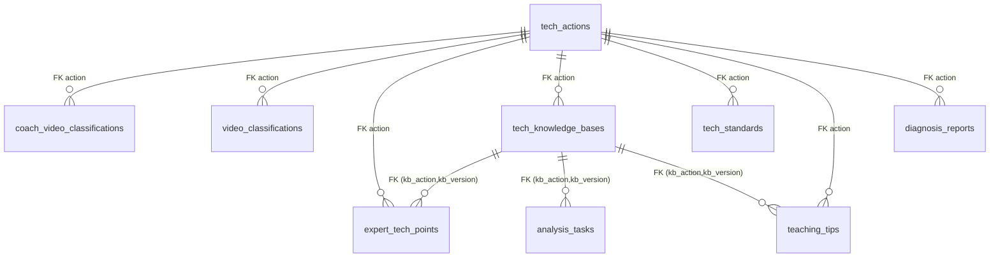
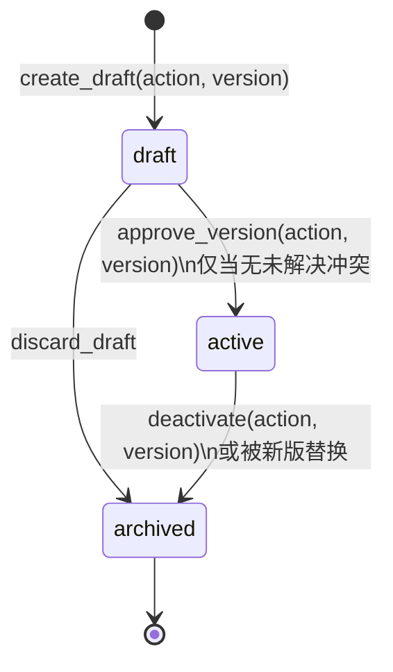

# 数据模型: 技术分类体系重构 (Phase 1)

**日期**: 2026-05-29  
**关联**: [plan.md](./plan.md) / [research.md](./research.md)  
**迁移**: `0022_tech_taxonomy_rebuild.py`（单一原子）

---

## 1. 实体关系图（ERD）



> 所有「分类语义」字段统一通过 `action` 单列引用 `tech_actions` 字典；不再有 `tech_category` / `category` / `tech_path` / `grip_type` / `rubber_type` / `hand` 散列存在。

---

## 2. 字典实体 — `tech_actions`

### 2.1 定义

| 字段 | 类型 | 约束 | 说明 |
|---|---|---|---|
| `category_l1` | `VARCHAR(32)` | **PK 第 1 列** + NOT NULL | 握拍方式（横拍 / 直拍）；当前 CSV 全为「横拍」 |
| `category_l2` | `VARCHAR(32)` | **PK 第 2 列** + NOT NULL | 胶皮类型（反胶 / 颗粒胶）；当前 CSV 全为「反胶」 |
| `category_l3` | `VARCHAR(64)` | **PK 第 3 列** + NOT NULL | 手部技术·技术大类，`·` 拼接（如 `正手·进攻`） |
| `action` | `VARCHAR(64)` | **PK 第 4 列** + NOT NULL | 具体动作名（CSV 第 5 列），56 行字典（初期 44 行 + Path 1' 拓展 12 行） |
| `created_at` | `TIMESTAMP` | DEFAULT now() | seed 落库时间 |

> **主键是复合主键 `(category_l1, category_l2, category_l3, action)`**。不使用单列 `action` 作为 PK 的原因详见 § 2.3 决策记录。

**索引**: `ix_tech_actions_l1l2l3 ON (category_l1, category_l2, category_l3)`，支持按层级筛选 action 列表（退化使用，因为 PK 本身已包含该前缀）。

### 2.2 Seed 内容（迁移内嵌）

迁移 `0022` 在 `upgrade()` 内通过 Python 读取 `specs/023-tech-classification-rebuild/contracts/tech-actions-seed.csv` 并执行 ZWSP 清洗（参考 research § 1）后批量 INSERT。Seed 后期望 56 行，与 [contracts/tech-actions-seed.csv](./contracts/tech-actions-seed.csv) 完全一致。

> **重名事实**：CSV 的 56 行中存在跨手部重名 action（如「高吊弧圈球」、「前冲弧圈球」、「平击发球」、「并步」、「交叉步」、「劈长」、「摆短」等既出现于正手也出现于反手），distinct action 数 = **35**（56 个四元组在 9 个 L3 桶中分布）。这是采用复合主键的根本原因。

### 2.3 主键决策记录（复合 PK）

CSV 实际数据存在跨手部重名（如「高吊弧圈球」既是正手进攻也是反手进攻），单列 `action` 主键会冲突。两种合规方案：

#### 方案 A：复合主键 `(category_l1, category_l2, category_l3, action)` 【采纳】

| 字段 | 类型 | 约束 |
|---|---|---|
| `category_l1` | `VARCHAR(32)` | **PK 第 1 列** |
| `category_l2` | `VARCHAR(32)` | **PK 第 2 列** |
| `category_l3` | `VARCHAR(64)` | **PK 第 3 列** |
| `action` | `VARCHAR(64)` | **PK 第 4 列** |
| `created_at` | `TIMESTAMP` | DEFAULT now() |

业务表外键全部使用复合外键 `(category_l1, category_l2, category_l3, action)`。

#### 方案 B：合成 `action_code = f"{l1}/{l2}/{l3}/{action}"` 单列主键

业务表只存 `action_code`；展示时拆分。

#### 选择方案 A 的理由

- 业务表既存 `action` 字符串又能 JOIN 字典获取层级，查询灵活
- 与 spec FR-003「输出严格四级字段：`category_l1`、`category_l2`、`category_l3`、`action`」直接对齐
- FK 复合列虽多，但是 RDBMS 标准做法；查询时 JOIN 性能可接受（56 行字典）
- 方案 B 的合成主键违反第一范式，每次过滤需字符串解析

#### 业务表外键写法（复合 FK）

```sql
ALTER TABLE coach_video_classifications
  ADD CONSTRAINT fk_cvclf_action
  FOREIGN KEY (category_l1, category_l2, category_l3, action)
  REFERENCES tech_actions (category_l1, category_l2, category_l3, action)
  ON UPDATE CASCADE
  ON DELETE RESTRICT;
```

---

## 3. 业务表 schema 改造清单

> 所有改造在迁移 `0022_tech_taxonomy_rebuild.py` 内完成。前置条件：system-init 已 TRUNCATE 业务数据（迁移本身不动数据）。

### 3.1 `coach_video_classifications`

```sql
-- DROP 旧列与索引
DROP INDEX IF EXISTS idx_cvclf_tech_category;
DROP INDEX IF EXISTS idx_cvclf_review_state_tech;
DROP INDEX IF EXISTS idx_cvclf_coach_tech;
ALTER TABLE coach_video_classifications DROP COLUMN tech_category;

-- ADD 四级字段（NULLABLE，因为 unclassified 时四级全为 NULL）
ALTER TABLE coach_video_classifications
  ADD COLUMN category_l1 VARCHAR(32),
  ADD COLUMN category_l2 VARCHAR(32),
  ADD COLUMN category_l3 VARCHAR(64),
  ADD COLUMN action      VARCHAR(64);

-- 复合外键（NULL 时不校验）
ALTER TABLE coach_video_classifications
  ADD CONSTRAINT fk_cvclf_action
  FOREIGN KEY (category_l1, category_l2, category_l3, action)
  REFERENCES tech_actions (category_l1, category_l2, category_l3, action)
  ON UPDATE CASCADE ON DELETE RESTRICT;

-- 新索引
CREATE INDEX idx_cvclf_action ON coach_video_classifications (action);
CREATE INDEX idx_cvclf_review_state_action ON coach_video_classifications (review_state, action);
CREATE INDEX idx_cvclf_coach_action ON coach_video_classifications (coach_name, action);
```

### 3.2 `video_classifications` （Feature-004 yaml 规则表）

同 § 3.1 的字段改造（仅 schema 改造，运行期是否启用 V2 yaml 由后续 feature 决定）。

### 3.3 `expert_tech_points`

```sql
ALTER TABLE expert_tech_points RENAME COLUMN tech_category TO action;
ALTER TABLE expert_tech_points RENAME COLUMN submitted_tech_category TO submitted_action;
ALTER TABLE expert_tech_points RENAME COLUMN kb_tech_category TO kb_action;
-- ADD 三级 category 列（与 coach_video_classifications 一致）
ALTER TABLE expert_tech_points
  ADD COLUMN category_l1 VARCHAR(32),
  ADD COLUMN category_l2 VARCHAR(32),
  ADD COLUMN category_l3 VARCHAR(64);
-- 重建外键
ALTER TABLE expert_tech_points DROP CONSTRAINT fk_etp_kb;
ALTER TABLE expert_tech_points
  ADD CONSTRAINT fk_etp_kb
  FOREIGN KEY (kb_action, kb_version)
  REFERENCES tech_knowledge_bases (action, version)
  ON DELETE CASCADE;
ALTER TABLE expert_tech_points
  ADD CONSTRAINT fk_etp_action
  FOREIGN KEY (category_l1, category_l2, category_l3, action)
  REFERENCES tech_actions (category_l1, category_l2, category_l3, action)
  ON UPDATE CASCADE;
```

### 3.4 `tech_knowledge_bases` （复合 PK 重命名）

```sql
-- DROP 子表外键（5 张）
ALTER TABLE expert_tech_points        DROP CONSTRAINT fk_etp_kb;
ALTER TABLE analysis_tasks            DROP CONSTRAINT fk_at_kb;
ALTER TABLE teaching_tips             DROP CONSTRAINT fk_tt_kb;
ALTER TABLE reference_videos          DROP CONSTRAINT fk_rv_kb;
ALTER TABLE skill_executions          DROP CONSTRAINT fk_se_kb;

-- DROP 旧 PK
ALTER TABLE tech_knowledge_bases DROP CONSTRAINT pk_tech_kb_cat_ver;

-- RENAME 列
ALTER TABLE tech_knowledge_bases RENAME COLUMN tech_category TO action;
ALTER TABLE tech_knowledge_bases
  ADD COLUMN category_l1 VARCHAR(32),
  ADD COLUMN category_l2 VARCHAR(32),
  ADD COLUMN category_l3 VARCHAR(64);

-- 重建 PK
ALTER TABLE tech_knowledge_bases
  ADD CONSTRAINT pk_tech_kb_action_ver PRIMARY KEY (action, version);

-- 字典外键
ALTER TABLE tech_knowledge_bases
  ADD CONSTRAINT fk_tkb_action
  FOREIGN KEY (category_l1, category_l2, category_l3, action)
  REFERENCES tech_actions (category_l1, category_l2, category_l3, action)
  ON UPDATE CASCADE ON DELETE RESTRICT;

-- 单 active 唯一索引（per-action）
DROP INDEX IF EXISTS uq_tech_kb_active_per_category;
CREATE UNIQUE INDEX uq_tech_kb_active_per_action
  ON tech_knowledge_bases (action) WHERE status = 'active';

-- 子表外键重建（kb_action,kb_version → tech_knowledge_bases.action,version）
-- 已在各表段落 § 3.3 / § 3.5 / § 3.6 / § 3.7 / § 3.8 中
```

### 3.5 `tech_standards`

```sql
ALTER TABLE tech_standards RENAME COLUMN tech_category TO action;
ALTER TABLE tech_standards
  ADD COLUMN category_l1 VARCHAR(32),
  ADD COLUMN category_l2 VARCHAR(32),
  ADD COLUMN category_l3 VARCHAR(64);
ALTER TABLE tech_standards DROP CONSTRAINT uq_ts_tech_version;
ALTER TABLE tech_standards ADD CONSTRAINT uq_ts_action_version UNIQUE (action, version);
DROP INDEX IF EXISTS idx_ts_active_per_category;
CREATE UNIQUE INDEX idx_ts_active_per_action
  ON tech_standards (action, source_fingerprint) WHERE status = 'active';
ALTER TABLE tech_standards
  ADD CONSTRAINT fk_ts_action
  FOREIGN KEY (category_l1, category_l2, category_l3, action)
  REFERENCES tech_actions (category_l1, category_l2, category_l3, action)
  ON UPDATE CASCADE ON DELETE RESTRICT;
```

### 3.6 `teaching_tips`

```sql
ALTER TABLE teaching_tips RENAME COLUMN tech_category TO action;
ALTER TABLE teaching_tips RENAME COLUMN kb_tech_category TO kb_action;
ALTER TABLE teaching_tips
  ADD COLUMN category_l1 VARCHAR(32),
  ADD COLUMN category_l2 VARCHAR(32),
  ADD COLUMN category_l3 VARCHAR(64);
DROP INDEX IF EXISTS ix_teaching_tips_tech_category;
CREATE INDEX ix_teaching_tips_action ON teaching_tips (action);
DROP INDEX IF EXISTS ix_teaching_tips_kb;
CREATE INDEX ix_teaching_tips_kb ON teaching_tips (kb_action, kb_version);
ALTER TABLE teaching_tips DROP CONSTRAINT fk_tt_kb;
ALTER TABLE teaching_tips
  ADD CONSTRAINT fk_tt_kb
  FOREIGN KEY (kb_action, kb_version)
  REFERENCES tech_knowledge_bases (action, version) ON DELETE CASCADE;
ALTER TABLE teaching_tips
  ADD CONSTRAINT fk_tt_action
  FOREIGN KEY (category_l1, category_l2, category_l3, action)
  REFERENCES tech_actions (category_l1, category_l2, category_l3, action)
  ON UPDATE CASCADE;
```

### 3.7 `diagnosis_reports`

```sql
ALTER TABLE diagnosis_reports RENAME COLUMN tech_category TO action;
ALTER TABLE diagnosis_reports
  ADD COLUMN category_l1 VARCHAR(32),
  ADD COLUMN category_l2 VARCHAR(32),
  ADD COLUMN category_l3 VARCHAR(64);
ALTER INDEX idx_dr_tech_category RENAME TO idx_dr_action;
ALTER TABLE diagnosis_reports
  ADD CONSTRAINT fk_dr_action
  FOREIGN KEY (category_l1, category_l2, category_l3, action)
  REFERENCES tech_actions (category_l1, category_l2, category_l3, action)
  ON UPDATE CASCADE;
```

### 3.8 `analysis_tasks`

```sql
ALTER TABLE analysis_tasks RENAME COLUMN kb_tech_category TO kb_action;
ALTER TABLE analysis_tasks DROP CONSTRAINT fk_at_kb;
ALTER TABLE analysis_tasks
  ADD CONSTRAINT fk_at_kb
  FOREIGN KEY (kb_action, kb_version)
  REFERENCES tech_knowledge_bases (action, version) ON DELETE SET NULL;
```

### 3.9 `reference_videos` / `skill_executions` / `athlete_motion_analyses`

外键列 `kb_tech_category → kb_action` 重命名 + FK 重建（同 § 3.8 模式，级联策略保持原样）。

---

## 4. 状态转换（业务流程对齐）

### 4.1 `tech_knowledge_bases.status` 状态机（per-action 分桶）



**章程级约束**：同一 `action` 维度上任意时刻最多 1 行 `status='active'`（FR-015 间接要求；业务流程文档 § 4.2 同步）。

### 4.2 `coach_video_classifications.review_state` 状态机

不变，但 DoD 判据从 `tech_path IS NOT NULL` 改为 `action IS NOT NULL AND action != 'unclassified'`。

---

## 5. 关键查询模式

### 5.1 按动作查询有效 KB 提取候选

```sql
SELECT cvclf.*
FROM coach_video_classifications cvclf
WHERE cvclf.action IS NOT NULL
  AND cvclf.action != 'unclassified'
  AND cvclf.review_state = 'approved'
  AND cvclf.kb_extracted = false;
```

### 5.2 按动作查询 active 标准

```sql
SELECT * FROM tech_standards
WHERE action = :action AND status = 'active'
LIMIT 1;
```

### 5.3 按层级聚合分类覆盖率

```sql
SELECT category_l1, category_l2, category_l3,
       count(*) AS total,
       count(action) FILTER (WHERE action != 'unclassified') AS classified
FROM coach_video_classifications
GROUP BY 1, 2, 3
ORDER BY 1, 2, 3;
```

---

## 6. ORM 模型变更清单

| 文件 | 变更 |
|---|---|
| `src/models/tech_action.py` | 🆕 新建：`class TechAction(Base)` 复合 PK 4 列 |
| `src/models/coach_video_classification.py` | drop `tech_category`；add `category_l1/l2/l3/action` + 复合 FK |
| `src/models/video_classification.py` | 同上 |
| `src/models/expert_tech_point.py` | rename `tech_category→action`、`submitted_tech_category→submitted_action`、`kb_tech_category→kb_action`；add 3 级 |
| `src/models/tech_knowledge_base.py` | 复合 PK 改为 `(action, version)`；add 3 级；FK 字典 |
| `src/models/tech_standard.py` | rename + add 3 级；唯一约束改名 |
| `src/models/teaching_tip.py` | rename `tech_category→action`、`kb_tech_category→kb_action`；add 3 级 |
| `src/models/diagnosis_report.py` | rename + add 3 级；index 改名 |
| `src/models/analysis_task.py` | rename `kb_tech_category→kb_action` |

所有改造遵循项目规则：异步 session、Pydantic v2、`X | None` 类型注解、`mapped_column` 写法。

---

## 7. 数据完整性校验（迁移后断言）

迁移 `upgrade()` 末尾 + `tests/integration/test_migration_0022_taxonomy.py` 断言：

```python
assert session.execute(text("SELECT count(*) FROM tech_actions")).scalar() == 44
assert session.execute(text("""
    SELECT count(*) FROM information_schema.columns
    WHERE table_name = 'coach_video_classifications' AND column_name = 'tech_category'
""")).scalar() == 0  # 列已物理删除
assert session.execute(text("""
    SELECT count(*) FROM pg_constraint
    WHERE conname = 'pk_tech_kb_action_ver'
""")).scalar() == 1  # 新 PK 存在
```
